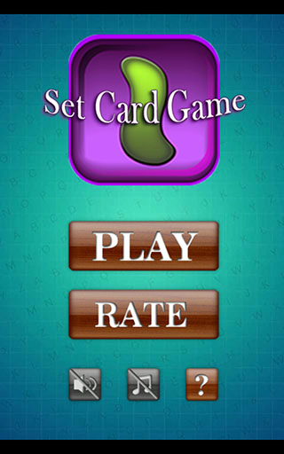
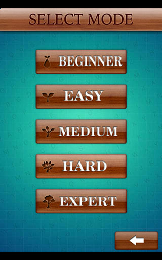
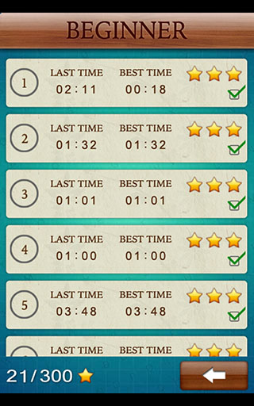
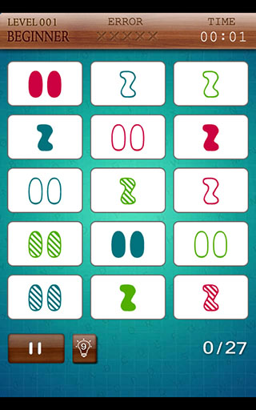
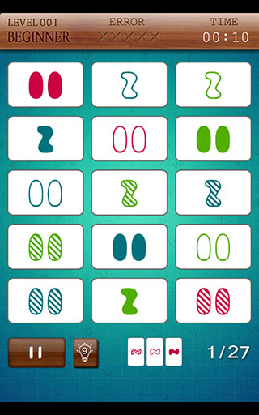

SetCard
=======
SetCard是一款基于Cocos2d-html5开发的卡牌消除类游戏，通过javascript bindings的方式编译到不同的平台里，达到一份代码可以运行在WEB、IOS、Andoid等多种终端上。

游戏时，每次选择3张卡牌进行消除，总共有81张卡牌，一局最多可以消27次。

每张卡牌含有下面4个属性：

* 个数(1、2、3)
* 颜色(红色、蓝色、绿色)
* 形状(方块、椭圆、扭曲)
* 填充(实心、半实心、空心)

消除时，对于选择的3张卡牌，必须符合对于每个属性，要么3张卡牌的都相同，要么3张卡牌都不相同。如果出现了2张卡牌是相同的属性，但和第三张不相同则不能消除。

## 游戏地址

[在线地址](http://set.ueapp.com)

[Android下载地址](https://play.google.com/store/apps/details?id=com.weizoo.SetCard)

由于没有iOS的开发者账号，所以没有发布到iOS上。

## 游戏截图

